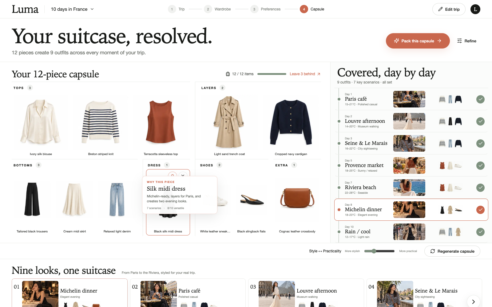

# AI Travel Wardrobe

A travel-first wardrobe optimizer that helps style-conscious travelers pack a compact, explainable capsule for multi-stop trips.

The product combines trip context, candidate clothes, personal preferences, luggage constraints, scenario coverage, and outfit visualization. It is designed to answer a practical question: **can I actually pack this suitcase now?**



## What works

- Create and edit a multi-city trip
- Set dates, activities, luggage size, laundry access, and dress requirements
- Select style, outfit-variety, and travel-photo priorities
- Optimize 15 candidate pieces into a compact capsule
- Lock or exclude individual garments
- Adjust the luggage limit and regenerate results
- See day-by-day scenario coverage and outfit combinations
- Understand why an item was selected and what can stay home
- Persist the prototype locally with `localStorage`
- Responsive desktop and mobile layouts

## Demo and mock mode

The seeded experience is a 10-day trip through France. France includes locally generated editorial imagery.

Custom destinations work without an API key. In mock mode they use destination-aware city placeholders instead of displaying misleading France photography. The UI and optimization engine are structured so a server-side image-generation provider can replace those placeholders later.

## Tech stack

- React
- TypeScript
- Vite
- CSS design system
- Local state and `localStorage`
- Transparent weighted optimization heuristic

## Run locally

Requires Node.js 18 or newer.

```bash
npm install
npm run dev
```

Open the local URL printed by Vite.

For a production build:

```bash
npm run build
```

## Project structure

```text
src/
  components/           Reusable product UI
  data/                 Seeded garment data
  features/trip/        Trip editor and scenario generation
  lib/optimizer/        Explainable capsule optimizer
  lib/types.ts          Shared domain types
public/assets/          Local garment and France demo imagery
```

## Optimization model

The MVP uses configurable, inspectable weights rather than opaque ML. It scores:

- scenario and activity coverage
- weather compatibility
- dress-code compatibility
- personal style and photo suitability
- versatility and repeat value
- redundancy and luggage cost

Locked pieces receive a hard inclusion bonus; excluded pieces are removed from consideration. The optimizer can later be replaced without rebuilding the product interface.
